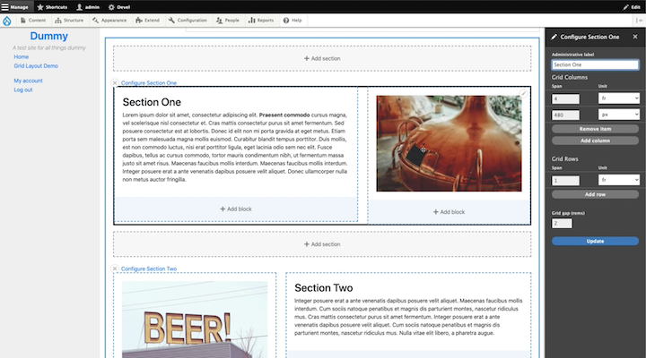

# CSS Grid

## About
This module uses CSS Grid's `grid-template-columns` and `grid-template-rows` properties to create dynamic layouts using layout builder. It's a (development) prototype module to explore the concept of integrating CSS Grid with Drupal 8's core Layout Builder plugin system.

## Install
Once the module has been installed, enable layout builder for a particular content type, then choose "CSS Grid" from the list of layout options. Add and adjust columns, rows, and gaps as needed to construct a content grid structure.
